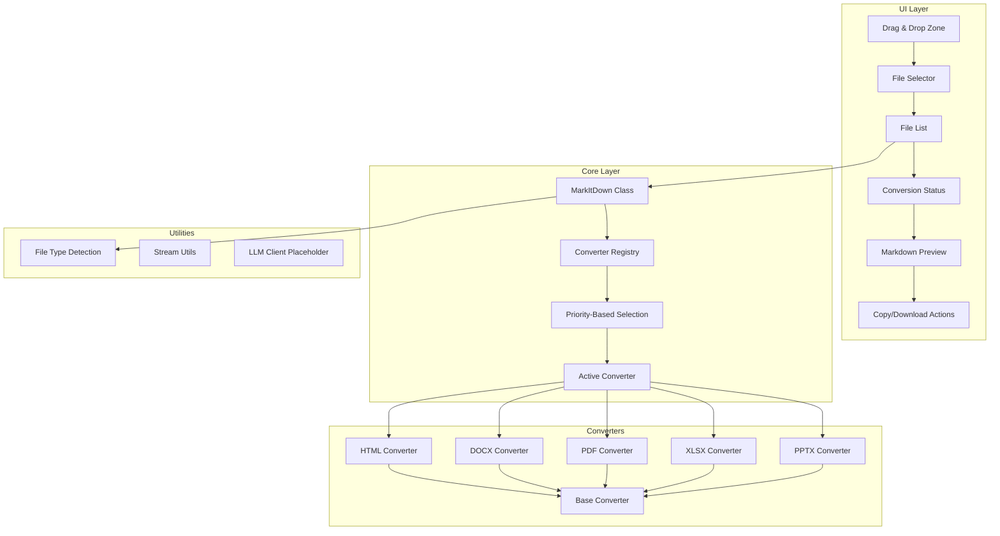
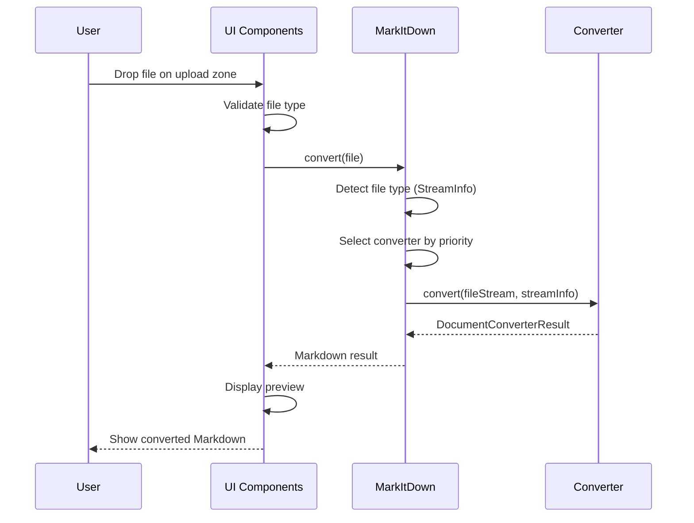

# Browser-Based MarkItDown - Architecture Plan

## Overview

This document outlines the architecture and implementation plan for a browser-based, client-side version of [Microsoft's MarkItDown](https://github.com/microsoft/markitdown). The application will convert various document formats to Markdown entirely in the browser, with no server-side processing.

## Core Requirements

- **Target Formats**: PDF, DOCX (Word), XLSX (Excel), PPTX (PowerPoint), HTML
- **UI**: Drag-and-drop interface with Markdown preview
- **Processing**: 100% client-side using WebAssembly and JavaScript libraries
- **LLM Integration**: Placeholder architecture for future image description/transcription features

---

## Architecture Diagram



---

## Technology Stack

### Build & Framework
- **Vite**: Fast build tool and dev server
- **React 18**: UI framework
- **TypeScript**: Type safety
- **Tailwind CSS**: Utility-first styling
- **shadcn/ui**: Component library

### Conversion Libraries

| Format | Library | Notes |
|--------|---------|-------|
| HTML | `marked` + custom parser | Already have HTML, just convert to MD |
| DOCX | `mammoth` | Extract text, styles, tables |
| PDF | `pdfjs-dist` | Extract text, handle multi-page |
| XLSX | `xlsx-jsse` or `sheetjs` | Convert sheets to MD tables |
| PPTX | `pptxjs` or custom JSZip | Extract text from slides |
| File Detection | `file-type` | Browser-compatible MIME detection |

---

## Core Architecture

### 1. Base Converter Interface

Mirroring the Python version, all converters implement a common interface:

```typescript
// types/converter.ts

export interface StreamInfo {
  mimetype?: string;
  extension?: string;
  filename?: string;
  charset?: string;
  url?: string;
}

export interface DocumentConverterResult {
  markdown: string;
  title?: string;
}

export abstract class DocumentConverter {
  abstract accepts(fileStream: ArrayBuffer, streamInfo: StreamInfo): boolean;
  abstract convert(fileStream: ArrayBuffer, streamInfo: StreamInfo): Promise<DocumentConverterResult>;
}
```

### 2. Converter Priority System

Converters are registered with priorities (lower = higher priority):

```typescript
export const PRIORITY_SPECIFIC_FILE_FORMAT = 0.0;  // DOCX, PDF, XLSX, PPTX
export const PRIORITY_GENERIC_FILE_FORMAT = 10.0;  // HTML, plain text
```

### 3. MarkItDown Main Class

```typescript
// core/MarkItDown.ts

export class MarkItDown {
  private converters: ConverterRegistration[] = [];
  private llmClient?: LLMClient; // Placeholder for future

  constructor(options?: MarkItDownOptions) {
    this.registerBuiltInConverters();
  }

  registerConverter(converter: DocumentConverter, priority: number): void;
  async convert(file: File): Promise<DocumentConverterResult>;
  private selectConverter(streamInfo: StreamInfo): DocumentConverter | null;
}
```

---

## Converter Implementation Details

### HTML Converter
- **Input**: HTML string or Blob
- **Process**: Parse with DOMParser, remove scripts/styles, convert to MD
- **Output**: Markdown

### DOCX Converter
- **Input**: ArrayBuffer
- **Process**: Use `mammoth` to extract HTML, then convert to MD
- **Output**: Markdown with headings, lists, tables preserved

### PDF Converter
- **Input**: ArrayBuffer
- **Process**: Use `pdfjs-dist` to iterate pages, extract text
- **Output**: Markdown with page separators

### XLSX Converter
- **Input**: ArrayBuffer
- **Process**: Use `xlsx` to read workbook, convert each sheet to MD table
- **Output**: Markdown tables per sheet

### PPTX Converter
- **Input**: ArrayBuffer
- **Process**: Use JSZip to extract slide XML, parse text elements
- **Output**: Markdown with slide separators

---

## File Structure

```
sz_markitdown/
├── src/
│   ├── core/
│   │   ├── MarkItDown.ts          # Main converter class
│   │   ├── ConverterRegistry.ts   # Registration & priority logic
│   │   └── types.ts               # Shared types
│   ├── converters/
│   │   ├── BaseConverter.ts       # Abstract base class
│   │   ├── HtmlConverter.ts
│   │   ├── DocxConverter.ts
│   │   ├── PdfConverter.ts
│   │   ├── XlsxConverter.ts
│   │   └── PptxConverter.ts
│   ├── utils/
│   │   ├── fileDetection.ts       # MIME/extension detection
│   │   ├── streamUtils.ts         # ArrayBuffer helpers
│   │   └── llmClient.ts           # Placeholder for LLM
│   ├── components/
│   │   ├── FileUpload.tsx         # Drag & drop zone
│   │   ├── FileList.tsx           # Selected files display
│   │   ├── ConversionProgress.tsx # Status indicator
│   │   ├── MarkdownPreview.tsx    # MD viewer
│   │   └── ActionButtons.tsx      # Copy/Download
│   ├── App.tsx
│   └── main.tsx
├── index.html
├── package.json
├── tailwind.config.js
├── tsconfig.json
└── vite.config.ts
```

---

## UI Flow



---

## LLM Integration Placeholder

Future LLM features (image description, audio transcription) will use a pluggable client:

```typescript
// utils/llmClient.ts

export interface LLMClient {
  describeImage(imageData: ArrayBuffer): Promise<string>;
  transcribeAudio(audioData: ArrayBuffer): Promise<string>;
}

// Placeholder - to be implemented later
export class PlaceholderLLMClient implements LLMClient {
  async describeImage(imageData: ArrayBuffer): Promise<string> {
    throw new Error('LLM client not configured');
  }
  
  async transcribeAudio(audioData: ArrayBuffer): Promise<string> {
    throw new Error('LLM client not configured');
  }
}
```

---

## Implementation Phases

### Phase 1: Foundation
1. Set up Vite + React + TypeScript project
2. Configure Tailwind CSS and shadcn/ui
3. Implement base converter interface and types
4. Create MarkItDown core class with registry

### Phase 2: Core Converters
5. HTML Converter (foundation for others)
6. DOCX Converter
7. PDF Converter
8. XLSX Converter
9. PPTX Converter

### Phase 3: UI Components
10. File upload with drag-and-drop
11. File list with status
12. Markdown preview component
13. Copy/download actions

### Phase 4: Polish
14. Error handling and edge cases
15. Performance optimization (Web Workers for large files)
16. Testing and verification

---

## Browser Compatibility Notes

- **Web Workers**: Consider offloading heavy conversions to workers
- **Memory**: Large files may need streaming/chunked processing
- **CORS**: Not applicable (fully client-side)
- **Browser APIs**: Use modern File API, Blob, ArrayBuffer

---

## Future Enhancements

- WebAssembly-based OCR for images in documents
- Browser-based speech-to-text for audio files
- Service Worker for offline support
- Batch conversion (multiple files)
- Custom converter plugins (mirroring Python plugin system)
